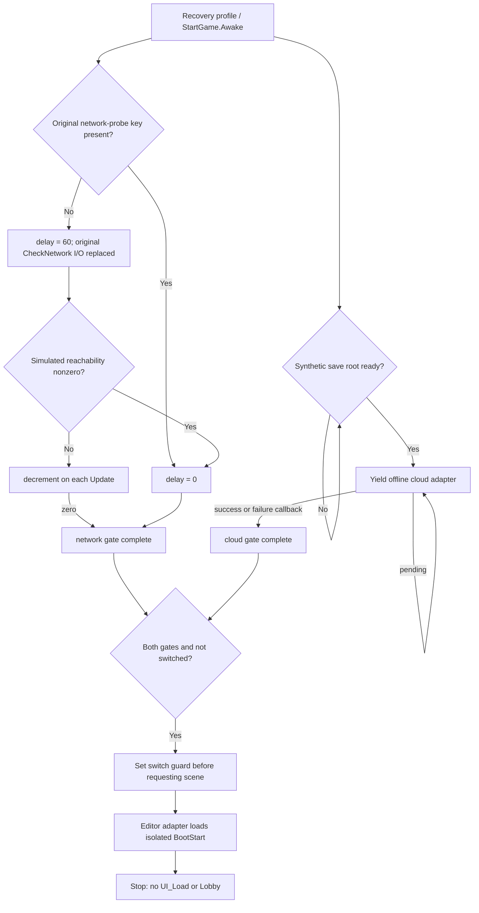

# Launch to Start recovery (Unity 2020.3.49f1)

**Historical Boot milestone.** The behavior/evidence below describes this isolated Launch → Start harness. The later [offline milestone](../GlobalConfig/README.md) adds a separate Lobby harness and GlobalConfig replacement. Current validation expects zero missing scripts; `-ValidateLobbyFlow` now checks all 36 UI/Boot/Lobby/GlobalConfig tests. Earlier one-missing-script results below are historical, not the current acceptance baseline.

Open **Recovery → Open Boot Recovery**, then Play. BootLaunch displays recovered Launch artwork and its font; the offline profile completes the cloud callback and the verified gates request BootStart. BootStart is the end of this milestone. Stop and Play starts a fresh recovery session.

The implementation recovers StartGame control flow at the adapter boundary. Real cloud save, the native engine bootstrap, debug data export, SceneHelper's full multi-scene behavior, UI_Load, Lobby and gameplay remain unrecovered. A successful test is not a claim that these services work.

## Evidence and flow

The ARM64 binary and metadata hashes match both their APK entries and the original Il2CppDumper run. [Machine-readable evidence](Evidence/native-evidence.json) records their hashes, metadata version 27, and all 44 inspected methods. Each RVA has annotated ARM64 disassembly beside it. GOT resolution uses ELF64 `R_AARCH64_RELATIVE` relocations followed by the corresponding Il2CppDumper metadata/string slot, rather than guessing names from Build Settings.



| Method / RVA | Verified native behavior | Recovery behavior / confidence |
| --- | --- | --- |
| `Start`, `0xD42494` | Calls `GameDataExport.Init` if the field is nonnull. | Call edge preserved. Callee/debug export remains a stub and is unbound in the active harness. High confidence on the call, no claim on the callee implementation. |
| `Awake`, `0xD42600` | Tests `PlayerPrefs.HasKey("_CheckNetwrok")`; the absent-key branch calls `Common.Util.CheckNetwork`, writes key=1 and sets delay=60 (`0xD42834`). Sets `IsAwake` and starts the iterator. | Profile substitutes the key's presence and connectivity, with no PlayerPrefs write. Reflection/native `SoccerMatchAI.StartEngine` initialization is excluded. High confidence on these branches; not a full Awake recovery. |
| Iterator factory, `0xD429AC`; iterator constructor `0xC56870` | Allocates state machine with state=0 and captures `this`. | C# iterator generated by Unity compiler. High confidence. |
| `MoveNext`, `0xC568A0`; predicate `0xC567FC` | If `PlayerSetting.Savepath` (static offset 0x18) is null/empty, yields WaitUntil it becomes nonempty. Then yields `GameDataPacker.CheckLoadCloudSave(callback, progress)`. | `SaveRootReady` replaces the real path; adapter yields configured result or remains pending. No real account or save file. High confidence on waiting/call structure. |
| Completion callback, `0xD42AA0` | Failure writes error=1 only if existing error=0. Both branches log and set `CheckCloudSaveFinish=true`, then call DoNext. | Retains error policy and gates; trace replaces native logging. High confidence. |
| Progress callback, `0xD42BD0` | `_loading.value = v / 100f * 0.15f`; constants at RVAs `0x2785A10` and `0x27C50E8`. | Exact arithmetic, with recovery cancellation guards. Test verifies 50→0.075 and 100→0.15. High confidence. |
| `Update`, `0xD42A24` | While network gate false: if delay>0, nonzero `Application.internetReachability` resets delay to zero, otherwise decrements. At zero, sets gate, invokes DoNext, decrements once more. | Exact branch/decrement order using synthetic reachability. Test verifies update 59, update 60 and final -1. High confidence. |
| `DoNext`, `0xD424A8` | Requires both flags and `!switchScene`; sets guard before constructing loads `["Scenes/UI/Start", "Scenes/UI/Launch"]`, empty hides, null completed, then `SceneHelper.LoadScenes` (`0x10D71EC`). | Preserves guard/order. Editor navigator replaces full multi-scene loading with one isolated BootStart. This substitution is deliberate; no claim of full SceneHelper recovery. High confidence on native arguments. |
| Constructor `0xD42A94`, static constructor `0xD42A9C` | Constructor delegates to MonoBehaviour; static constructor immediately returns. | Default field initialization retained. High confidence. |
| Awake predicate `0xC5674C` | Checks `SL.ABTest` / `PlayerSetting` flags used in the native engine-start callback. | Catalogued, not executed; native engine initialization is outside this milestone. |

IDA's earlier attempt did not produce a usable function analysis. Ghidra's initial whole-binary analysis timed out and its supplied Python importer required PyGhidra. `Tools/ExportBootDecomp.java` in the APK repository provides a working targeted Java fallback. [Ghidra output](Evidence/ghidra-boot.c.txt) uses image base `0x100000`; its displayed addresses therefore equal RVA+base. The annotated ARM64 files remain the source of truth for branches and metadata names; incomplete inferred C prototypes are not treated as recovered signatures.

`dynamic-symbols.txt` is the import/export survey. It includes libc file/memory APIs, dynamic linking and platform/thread functions. Their presence does not prove boot invokes them. No device, original APK process, external service, or native library was executed during this analysis.

## Isolation and compatibility

- Existing StartGame class, namespace, signatures, serialized fields and `.meta` GUID are retained. New runtime fields are private and nonserialized.
- Original scenes remain untouched. Recovery references are copies with **every original GameObject inactive and every Behaviour disabled before import**. BootLaunch/BootStart retain these inert hierarchies and add a separate audited UI/runtime harness. [Isolation manifest](scene-isolation.json) lists original script GUIDs and source hashes.
- Disabling a Behaviour alone would not prevent Awake; GameObject inactivity is essential here. PlayMode tests inspect the inactive hierarchies and reject unaudited active components.
- Recovery StartGame only opts in on an object containing its local offline adapter. Original scenes retain their previous stub behavior. Each new MonoBehaviour has its own source file and GUID.
- The new assembly `Soccer.Recovery.Boot` is referenced by Assembly-CSharp; the existing editor assembly references it explicitly. No duplicate UI package is installed.
- Editor scene loading uses `EditorSceneManager.LoadSceneAsyncInPlayMode`, so Build Settings remain unchanged. This is an **Editor recovery harness**, not a standalone build-ready boot flow.
- Profile inputs live in memory only. `InitialError`, simulated reachability, saved network-probe status, save-root readiness, callback delay and outcome are explicit synthetic values. Manual default: unrecorded probe, unreachable network, ready synthetic save root, success after 90 adapter frames. This delay belongs to the adapter, not the original game.
- Cancellation on disable, one-shot completion consumption, and static/session resets are new recovery protections. They are not claimed as native behavior. Captured callbacks from destroyed sessions cannot mutate the next session. No arbitrary timeout is added to original control flow.

## Dependencies toward Lobby (not implemented)

| Entry / RVA | Verified references and calls | Remaining work |
| --- | --- | --- |
| `UI_Load.Start` `0x153D1C8` | GameDataExport.Init, ResourcesManager.OnInitialized, UI_Load.Init | Resource lifecycle and callback ownership, debug-export scope. |
| `UI_Load.StartInit` `0x153D4FC` | StringLoader.Init, SoundEffect.Init, ViewManager.Init, Connection.AddListener, SoccerLegend.Init, PlayerSetting.LoadNationality, ConfigResolution.InitResolution, IAPStoreClient.LoadAll, CommentatorBundleLoader.Load, Commentator.LoadLanguage, PlayerSetting.RequestCityInfo | Separate local content dependencies from network, IAP and account services. Do not enable this method yet. |
| `UI_Load.Update` `0x153DC60` | Loading flags/progress, AB-test waiting, PlayerSetting state, MainView routing, EventLog, FriendlyMatchManager and teaching-match branch | Analyze each condition and coroutine before any Lobby or match transition. |
| `MainViewLoader.Awake` `0xD1BAC0` | ResourcesManager.LoadPrefab with `Assets/GameData/UI/Windows/MainView/MainViewWithShop.prefab`; instantiate/GetComponent(MainView); child `MainView`; ABTest.EnablePlayerCareer chooses `LoadForPlayerCareer`/`LoadForlegacy`; low-memory check | Recover ResourcesManager/MainView and both initialization branches with tests. |
| Player-career / legacy loaders `0xD1BDF0` / `0xD1C0FC` | Native disassembly and metadata signatures archived | Map their UI/data dependencies before implementing. |

Generic-shared addresses such as Singleton<T>.get_Instance are not resolved from address alone. Concrete `T` comes from the GOT MethodInfo annotation at the call site.

## Validate and reproduce

Close this project's Editor, then run in Windows PowerShell:

```powershell
& 'C:\Users\ZGAMESVN\Downloads\Soccer-Mobile-Pro-APK\Recover-SoccerUnity.ps1' -ValidateBootFlow
```

This validates the project/assets, reruns the four offline UI PlayMode tests and twelve boot tests. It rejects skipped/missing tests, compiler/assembly/crash errors and asset regressions beyond the existing one missing script in `Win_GlobalConfig.prefab`. It produces `boot-validation.json`, NUnit XML and per-test event traces under `Soccer-Unity-Recovery/Runs/BootValidation-*`. A pending-state test proves the test watchdog diagnoses waiting; runtime remains pending without an invented timeout.

To reproduce static evidence, run `python Tools/Analyze-BootEvidence.py` from the APK repository with the existing extracted inputs. The script verifies hashes before disassembling and never executes the binary. Ghidra database and original exports remain outside Unity's imported Assets.

The earlier four-test boot report predates review of first-run/network/save-path branches. It remains historical and is superseded by the twelve-test validation delivered with this milestone.
