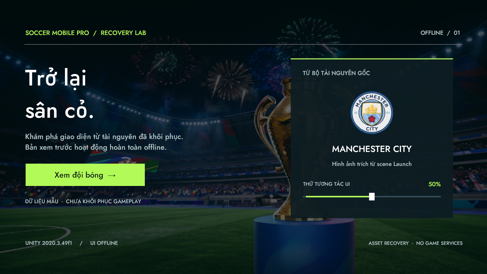

# Offline UI milestone

The later [offline recovery milestone](GlobalConfig/README.md) validates UI, Boot, Lobby and GlobalConfig together (36 tests). The expected missing-script count is now zero through an explicitly labeled GlobalConfig replacement. Earlier one-missing-script results below are historical.

Open the project in Unity **2020.3.49f1**, choose **Recovery > Open Offline UI**, then enter Play Mode. Scene: `Assets/Recovery/Scenes/OfflineUI.unity`. Original scenes and Build Settings are unchanged.

The screen uses the recovered `loading_worldcup26` background, `badge_mancity` sprite and `BAHNSCHRIFT.ttf` font. The new `Soccer.Recovery.OfflineUI` assembly manages only the welcome/team panels and a preview slider. “Xem đội bóng” opens the sample team panel; “Quay lại” returns. Data is explicitly marked as an offline sample. No account, game bootstrap, ad, payment, network client or match simulation is invoked by this controller.

The scene uses restored uGUI, not TMP, DOTween or SoftMask. Source restoration details and the complete type/hash mapping are under `Assets/Scripts/UnityEngine.UI/RecoveryProvenance.md`. Existing game code and other recovered libraries still contain stubs.

## Validate

Close the Editor for this project and run:

```powershell
& 'C:\Users\ZGAMESVN\Downloads\Soccer-Mobile-Pro-APK\Recover-SoccerUnity.ps1' -ValidateOfflineUI
```

This first runs the existing whole-project compiler/asset validation, then runs four PlayMode tests through the real EventSystem and StandaloneInputModule with deterministic mouse input. It checks click counts, panel navigation, slider callbacks, repeated loading/enabling, text bounds, slider geometry and button raycasts. Render captures cover welcome/team at 1920×1080 and 2560×1080.

Results, screenshots and logs are written outside the repository to `Soccer-Unity-Recovery/Runs/OfflineValidation-*`. `offline-validation.json` separates `compilationSucceeded`, `offlineUiSucceeded`, and `gameplayRecovered` (always false at this milestone). Skipped/missing tests, missing screenshots, unexpected editor errors or new missing scripts fail validation.

The known missing component in `Win_GlobalConfig.prefab` remains unchanged. `missing-script-evidence.json` documents the asset mapping and comparison with the original export. A similarly named string is not sufficient evidence to invent a MonoBehaviour replacement.

The authoring utility refuses to overwrite an existing scene. Normal scene edits should be made in Unity; the validation command does not regenerate or repair code/assets. Screenshots prove this offline UI milestone only, not restored original gameplay.

## Recorded result

Validated on 2026-09-24: whole-project compilation passed; all four PlayMode tests passed; no additional missing scripts or editor errors were reported. Original metadata and Build Settings were preserved. See `offline-ui-validation.json` for the portable result summary.



[Team panel at 2560x1080](Screenshots/team-2560x1080.png)
